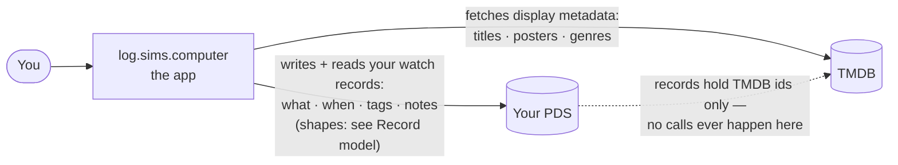
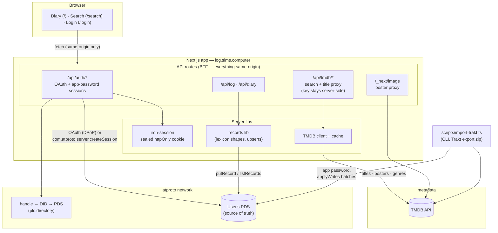

# Architecture

## What this is

A thin wrapper around the data in **your own atproto PDS**: it writes your watch history there as interoperable records, reads it back to show your diary, and garnishes it with metadata fetched from TMDB. The app holds no data of its own — if it vanished tomorrow, your history is intact in your PDS and readable by any app that speaks the lexicons.

## How it's shaped

One Next.js app acting as UI + backend-for-frontend: the browser only ever talks to the app's own origin, and the app talks to the world. There is no database — the diary is read straight back out of the PDS. A CLI importer writes history in bulk through the same record library.

Invariants worth knowing without reading code:

- **Same-origin rule**: no browser request ever leaves the app's origin — TMDB data comes through the proxy routes, posters through `/_next/image`. Keeps the TMDB key server-side and the whole app observable to Aviator verify's collector (which drops cross-origin traffic).
- **Two auth paths**: OAuth (confidential client, DPoP) for humans; app-password sessions for the importer and automation. `/api/auth/test-login` is env-gated — active only where `ATP_TEST_*` secrets exist (preview), absent in production.
- **Single-process assumptions**: OAuth state and the TMDB cache are in-memory. Fine for one instance; these move to the appview's store when it exists.

## Deeper dives

- [Record model & Popfeed interop](./records.md)
- Appview (Jetstream → SQLite: tag pages, feeds, stats) — *not built yet; gets its own doc with its slice*
- Deploy topology (nimbus, Cloudflare) — *not built yet; same*
