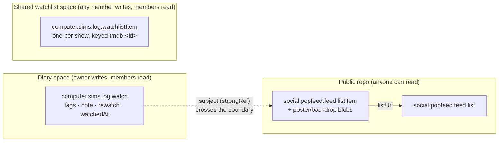

# Lexicons: what we speak, where it lives, and who can read it

A lexicon is a named, shared record schema — an NSID like `social.popfeed.feed.listItem` plus the shape of records stored under it. Apps interoperate on atproto by **writing each other's record types directly** into the user's repo, not by talking to each other. There is no bridge or translation layer anywhere in this app.

This is the single reference for every record and space type tvlog touches: the shapes, where each one is stored, and what the public/private split reveals. Field-level modeling rationale (per-work vs per-play grain, the Popfeed-first design rule) lives in [Record model](./records.md); the OAuth-scope machinery behind spaces is in [Spaces OAuth scopes](./plans/spaces-oauth-scopes.md).

## 1. Record and space types

"Ours" = the `computer.sims.*` namespace (NSID authority = the sims.computer domain). "Vendored" = Popfeed's `social.popfeed.*` schemas, which we write directly so a popfeed.social profile lights up with our data. Required fields are marked `*`.

| NSID | Origin | Lexicon type | Shape (required\* / optional) | Record key | Where it lives |
|---|---|---|---|---|---|
| `social.popfeed.feed.list` | vendored | record | `name*`, `createdAt*` / `authorDid`, `description`, `tags`, `listType`, `ordered`, `itemOrder` | `tid` | **public repo, always** |
| `social.popfeed.feed.listItem` | vendored | record | `identifiers*`, `creativeWorkType*`, `addedAt*`, `listUri*` / `title`, `posterUrl`, `poster` (blob), `backdropUrl`, `backdrop` (blob), `genres`, `mainCredit`, `mainCreditRole`, `releaseDate`, `watchedEpisodes`, `listType` | `tid` | **public repo, always** |
| `computer.sims.log.watch` | ours | record | `subject*` (strongRef), `tmdbId*`, `mediaType*`, `watchedAt*`, `createdAt*` / `rewatch`, `season`, `episode`, `tags`, `note` | `tid` | **diary space** on spaces-capable accounts; **public repo** otherwise |
| `computer.sims.log.watchlistItem` | ours | record | `tmdbId*`, `mediaType*`, `title*`, `addedAt*` / `posterUrl`, `year` | `any` (code uses `tmdb-<id>`) | **shared watchlist space only** — never written to the public repo (see §2) |
| `computer.sims.log.diary` | ours | space type | `collections: [computer.sims.log.watch]`, `key: literal:diary` | skey `diary` (one per owner) | space definition; published as a schema record on the authority repo |
| `computer.sims.log.watchlist` | ours | space type | `collections: [computer.sims.log.watchlistItem]`, `key: literal:watchlist` | skey `watchlist` (one per owner) | space definition; published as a schema record on the authority repo |
| `computer.sims.log.permissions` | ours | permission-set | 2 `space` permissions (diary + watchlist) | rkey = the NSID when published | authority repo, collection `com.atproto.lexicon.schema` (see §3) |
| `computer.sims.log.party` | ours | space type | *(planned — not yet in `lexicons/`)* | skey = per-party `tid` | **planned**, see §3 and [watch-parties-v1](./plans/watch-parties-v1.md) |

### How routing decides "where it lives"

The public-repo vs space decision is made in exactly one place — `src/lib/atproto/routing.ts` — and the record helpers take the resolved routing without re-deriving it. The decision keys off `session.spacesCapable`, cached at sign-in by the capability probe (`detectSpacesCapability` in `spaces.ts`, a `getSpace` on the account's own diary space):

- **Shelf** (`social.popfeed.feed.list` + `listItem`) → **always the public repo.** The write helpers hardcode `PUBLIC_REPO` for these collections; there is no space route for the shelf.
- **Diary** (`computer.sims.log.watch`) → the **diary space** iff `spacesCapable === true`, else the public repo. A capable account's diary space is auto-ensured at sign-in (`initSpacesForSession` → `ensureDiarySpace`), so no per-write existence probe is needed. Only a definitive `true` routes into the space; `undefined`/`false` (e.g. bsky.social, where the space methods aren't implemented) stays public with **zero** extra network calls.
- **Watchlist** → the **shared watchlist space** iff `spacesCapable === true` **and** the watchlist space exists (`watchlistSpaceExists` probe). The watchlist space is opt-in — the owner creates it — so its existence gates routing. A probe failure falls back to public rather than breaking the request.

## 2. The public/private taxonomy

Three audiences, three homes. The rule is an audience taxonomy, not a schema one: *private is a location, not a shape.*

**Shelf — public, always.** The Popfeed list + listItem records (plus the uploaded poster/backdrop blobs) go to the user's public repo unconditionally, for interop: this is what makes a popfeed.social profile — or any future lexicon-speaking app — light up with the user's watch history, with zero effort on either side. "Watched" status is expressed by *which* media-type-specific list an item sits in (`watched_movies`, `currently_watching_tv_shows`, `watched_tv_shows`), not a status field.

**Diary — the user's own space on spaces-capable accounts, public repo otherwise.** `computer.sims.log.watch` carries the per-play commentary the shelf can't hold: `watchedAt`, `tags`, `note`, `rewatch`, and TV `season`/`episode`. On a spaces-capable account these records live in the single-writer **diary space** (owner writes, friends are members/readers); on bsky.social they fall back to the public repo. Crucially the **record shape is identical either way** — only the location changes. (See the [discrepancy note](#5-accuracy-notes-code-vs-docs) on "mood," which the diary space *description* advertises but the record has no field for.)

**Shared watchlist — the shared watchlist space when it exists.** Here the split is sharper: the *concept* of "a show I mean to watch" has **two different record types depending on route**, not one shape in two places:

- In a **shared watchlist space**, an add is a `computer.sims.log.watchlistItem` — a lightweight per-show record written into the adding member's own space-repo, keyed `tmdb-<id>` so adds are idempotent. Any member can add; every member sees the union (a cross-member read sweeps each member's repo and dedupes by `tmdbId`, keeping the earliest add). Removing an entry removes only *your own* — another member's entry keeps the show on the shared list.
- In **public mode** (no watchlist space), a watchlist add is instead a `social.popfeed.feed.listItem` in the `tv_show_watchlist` list. This is the same shelf machinery, and logging the show's first episode migrates that same record in place from `tv_show_watchlist` into `currently_watching_tv_shows`.

So `computer.sims.log.watchlistItem` is **never** written to the public repo, and the public watchlist is **never** a `watchlistItem` record. This asymmetry (watch = one shape, two locations; watchlist = two shapes, two locations) is worth keeping in mind when reasoning about a given account's repo.

### The cross-boundary strongRef

Every `computer.sims.log.watch` record carries `subject`, a `com.atproto.repo.strongRef` (URI + CID) pointing at the `social.popfeed.feed.listItem` for that work. On a spaces-capable account the watch record lives in the **private diary space** while its subject listItem lives in the **public repo** — so the strongRef crosses the privacy boundary, pointing *out* of the space into public data.

What this reveals to a public observer: only that the shelf item exists (which was already public — the whole point of the shelf). It does **not** reveal the diary commentary. The reference runs private→public, not the reverse; there is no pointer from the public listItem back to the diary entry, and a non-member cannot read the diary space at all. The `tmdbId`/`mediaType` denormalized onto the watch record exist so the diary layer survives even if the subject listItem can't be resolved — resilience, not a second disclosure.

## 3. Spaces and permissions

### The space types

| Space type | skey | Writers | Readers | Status |
|---|---|---|---|---|
| `computer.sims.log.diary` | fixed `diary` (one per owner) | owner only (single-writer) | owner + members | shipped |
| `computer.sims.log.watchlist` | fixed `watchlist` (one per owner) | any member (multi-writer, each into their own space-repo) | owner + members | shipped |
| `computer.sims.log.party` | per-party `tid` (many per host) | host writes the event; each member writes their own RSVP/comments | members | **planned** ([watch-parties-v1](./plans/watch-parties-v1.md)) |

Discovery is deterministic for the two shipped types: fixed `(type, skey)` conventions mean "does it exist" is a `getSpace` by URI, never a `listSpaces` scan. The planned party type breaks that pattern deliberately — one space per party at a generated `tid` skey — and would carry four collections (the `community.lexicon.calendar.event` + `rsvp` records reused verbatim, plus `computer.sims.log.watchParty` and `.partyComment` sidecars). It is groundwork only: no lexicon file, no permission-set entry, and no code exist for it yet.

Spaces do **not** validate app lexicons (`validationStatus: "unknown"`) — schema conformance is client discipline only. That is why the record-type lexicons in `lexicons/` are for reference and codegen, not enforcement.

### The permission set

`computer.sims.log.permissions` is a `permission-set` with two `space` permissions, one per shipped space type. Each grants, on its space type: `action: [read, create, update, delete]` on the type's one collection, and `manage: [create, update, delete]` for space/membership lifecycle.

- **Why skey-specific (`skey: "diary"` / `"watchlist"`).** The grant is scoped to the exact fixed skey each space uses, matching `spaces.ts`. A wildcard `skey: "*"` would also work (there is one space per type per owner), so this is a tightening choice, not a requirement.
- **Why `authority: "*"`.** `authority` is the *owner DID whose spaces the token may act on*. tvlog is social: a user reads a friend's diary and co-writes a shared watchlist **owned by another member**, and every such cross-owner operation asserts against the owner's DID. `authority: "self"` resolves to the caller's own DID and would never match another owner, breaking friend-reads and shared writes — so both entries need `"*"`. The owner's PDS still enforces membership independently, and `manage` operations additionally call `assertSpaceOwner`, so holding the grant never lets a member manage someone else's space.

`transition:generic` (the scope bsky.social sessions carry) grants **no** space access at all — it is explicitly overridden to grant nothing for spaces. That is why the capability probe fails on a legacy OAuth token, and why reaching spaces requires an OAuth token minted through a client that declares `include:computer.sims.log.permissions`.

### The resolution chain

When a spaces PDS sees `include:computer.sims.log.permissions` in a scope, it resolves the set like this:

1. **DNS authority.** TXT lookup on `_lexicon.log.sims.computer` (the NSID authority is the DNS-ordered domain: `computer.sims.log.permissions` → `log.sims.computer`). The single `did=` line names the **authority DID** — Sim's bsky.social account, `did:plc:gqorgf2irpe5vy6osekgc3be`. A normal bsky.social account suffices; the resolver only needs a signed, sync-fetchable repo.
2. **Signed fetch.** Fetch `at://<did>/com.atproto.lexicon.schema/computer.sims.log.permissions` via `com.atproto.sync.getRecord`, then verify the commit signature and walk the MST to the record. Resolution is authenticated, not a plain HTTP GET.
3. **Type check.** Require `defs.main.type === "permission-set"`.
4. **Consent-screen space types.** The authorize page *also* resolves each `space` **type** lexicon (`computer.sims.log.diary`, `.watchlist`) to render the consent unit — so those two space-type schemas must be published too, not just the permission set.

## 4. How to change a lexicon

1. **Edit** the JSON under `lexicons/`.
2. **Republish** with `scripts/publish-lexicons.mjs`, signed in as the authority account (`sims.computer`, handle + app password read from stdin only). It writes each `computer.sims.log.*` lexicon as a `com.atproto.lexicon.schema` record (rkey = the NSID) to the authority repo. The `social.popfeed.*` files are skipped — they belong to a different authority. Publishing is **idempotent**: the script digests the existing record and prints `unchanged` when the doc matches, `published` when it writes. `--dry-run` prints the plan and the DNS TXT record the authority owner must create, with no network calls.
3. **Decide whether users must re-consent:**
   - **Re-consent required** for changes to the **permission set that affect granted scope** — new/changed space permissions, collections, actions, or `manage` ops. A token carries the permissions *resolved at issuance*, so existing sessions keep the old grants until the user re-authorizes through the spaces client. Republish the set (and any new space-type lexicon) **before** the next spaces login: an unresolvable permission set hard-fails the authorization request.
   - **No re-consent** for changes that are documentation only — edits to the **record-shape lexicons** (`computer.sims.log.watch`, `.watchlistItem`). Spaces don't validate lexicons, so these files never gate a runtime write; they exist for humans and codegen. Editing them changes nothing users have consented to.

> Note: the script publishes **all** `computer.sims.log.*` files it finds — currently five, including the two record-shape lexicons — but OAuth resolution only *consumes* three (`permissions`, and the `diary`/`watchlist` space types). Publishing the record-shape schemas is harmless (extra, unreferenced schema records), just broader than the resolver needs.

## 5. Accuracy notes (code vs docs)

Where a plan or a description disagrees with the code, the code is authoritative. The discrepancies found while writing this:

- **"mood" is advertised but not modeled.** The `computer.sims.log.diary` space description ("tags, notes, and mood") and `spaces-v1.md` both list *mood* as a diary field, but `computer.sims.log.watch` has no `mood` property — the per-play fields are `tags`, `note`, `rewatch`, `season`, `episode`, `watchedAt`. Treat "mood" as aspirational copy, not a field.
- **The "ships without a lexicon file" comment is stale.** `records.ts` says `computer.sims.log.watchlistItem` "ships without a lexicon file" (because spaces don't validate). A `lexicons/computer.sims.log.watchlistItem.json` file *does* exist now (as does one for `watch`), and `publish-lexicons.mjs` publishes it. The claim that spaces don't validate is still true; the "no file" half is outdated.
- **URI scheme is `at://` today, not `ats://`.** `space-uri.ts` currently emits `at://<did>/space/<type>/<skey>[/<writer-did>/<collection>/<rkey>]` (parsing accepts both schemes). `watch-parties-v1.md` sketches use `ats://…`; `spaces-v1.md` notes the choice is unsettled upstream. The one-line switch lives in `SPACE_URI_SCHEME`; as written, the scheme is `at://`.
- **`movie_watchlist` is defined but unused.** The `ListType` union and `LIST_NAMES` include `movie_watchlist`, but no code path writes it — the only watchlist list type actually created is `tv_show_watchlist`. (`tv_show_watchlist` itself remains our own coinage, not a value seen in live Popfeed repos; adopt Popfeed's value verbatim if a TV watchlist type ever appears there.)

### Determinable only from plans, not code

- The **party** space type, its collections, and its permission-set entry exist only in `watch-parties-v1.md` — no lexicon file, permission entry, or implementation is in the repo yet.
- Whether spike accounts also write the **public shelf** (which would require adding granular `repo:`/`blob:` scopes to the spaces OAuth client) is an unresolved product decision, per `spaces-oauth-scopes.md`. The write seam supports either.
</content>
</invoke>
