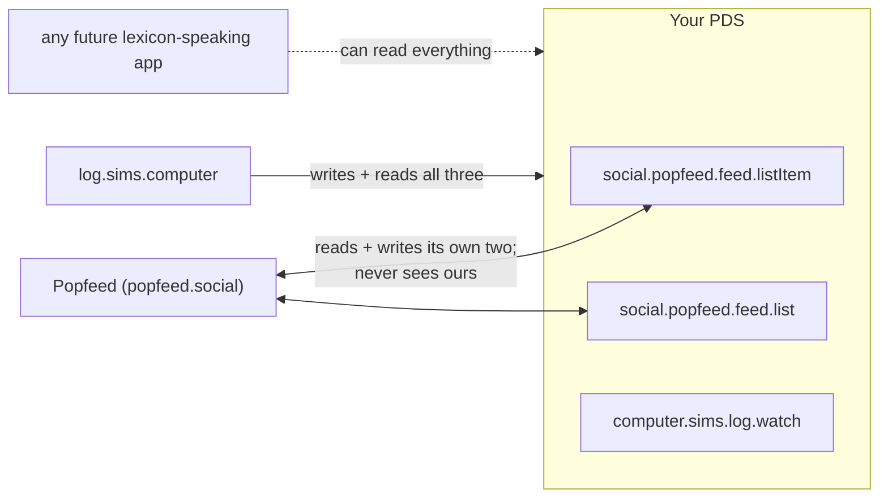

# Lexicons: what we speak, and to whom

A lexicon is a named, shared record schema — an NSID like `social.popfeed.feed.listItem` plus the shape of records stored under it. Apps interoperate on atproto by **writing each other's record types directly** into the user's PDS, not by talking to each other. There is no bridge or translation layer anywhere in this app.

## The three collections we write

| Collection | Whose vocabulary | What it holds | Who reads it |
|---|---|---|---|
| `social.popfeed.feed.listItem` | Popfeed's | one record per work: identifiers, display fields, episode progress | Popfeed, us, anyone |
| `social.popfeed.feed.list` | Popfeed's | the lists that give items status (`watched_movies`, `currently_watching_tv_shows`, …) | Popfeed, us, anyone |
| `computer.sims.log.watch` | **ours** (`computer.sims.*`, NSID authority = the sims.computer domain) | one record per **play**: watchedAt, tags, notes, rewatch, season/episode — the diary layer | only us, today |

## Why this split

Design rule (from SPEC.md): **anything Popfeed's lexicon can express goes in Popfeed's records** — that's what makes a popfeed.social profile light up with our data, with zero effort on their side or ours. Our own namespace exists only for what their schema cannot hold: per-play diary entries with free-form tags. The `watch` record points at its `listItem` via strongRef, so the layers stay linked.

Note the relationship precisely: **neither schema is a subset of the other — they differ in grain.** Popfeed's records are *per-work* (one listItem per movie/show: shelf state, episode progress, poster/genres/credits — none of which we duplicate). Ours are *per-play* (one watch per viewing: timestamp, tags, note, rewatch). Shelf and journal: watch Alien three times → three journal entries, one shelf item. Delete our collection and Popfeed users lose nothing; delete Popfeed's and the diary loses its shelf.

The corollary: our tags and notes are invisible to Popfeed (it doesn't know our collection exists), and if Popfeed ever grows equivalent fields, the design rule says we adopt theirs and retire ours. Same for ratings: Popfeed has `social.popfeed.feed.review` (integer 1–10) which we don't write yet — when ratings matter, we adopt that rather than inventing one.

## Where the schemas came from (and where they live)

- `lexicons/` in this repo holds vendored JSON schema files — for reference and codegen, not enforced by the PDS (writes use `validate: false`; the PDS can't resolve these lexicons).
- The Popfeed schemas were **initially copied from Bookhive's repo** (a Goodreads-style atproto app that vendors a Popfeed snapshot). That's Bookhive's entire role in our lexicon story — we write no `buzz.bookhive.*` records. Bookhive also served as the architecture template for the app itself.
- The vendored snapshot proved **stale**: live Popfeed records (confirmed against the Popfeed developer's own repo, 2026-07-25) have no status fields, key TV on `tmdbId`, and use media-specific list types. Our vendored copies were corrected to match reality. Lesson recorded here on purpose: **for closed-source apps, live records in real repos are the schema authority — vendored files are hearsay.**

Shapes and field-level rules: see [Record model](./records.md).
