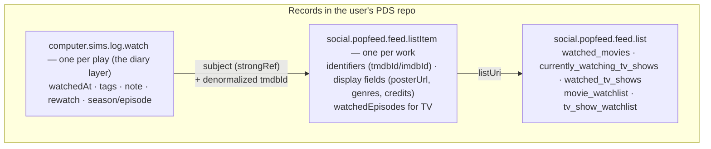

# Record model

How watch history is stored in the user's PDS. Interoperates with [Popfeed](https://popfeed.social); shapes were confirmed against live Popfeed repos, not just vendored lexicons (see SPEC.md → Lexicons).

## Rules

- Anything Popfeed's lexicon can express lives in Popfeed records; `computer.sims.log.watch` adds only what it can't (per-watch tags and notes).
- Watch status is **list membership** — there is no status field on listItems. Movies land in `watched_movies`; shows logged per-episode sit in `currently_watching_tv_shows` until fully watched.
- The **watchlist** is just another list: a show you mean to watch is a listItem in `tv_show_watchlist` (movies use `movie_watchlist`). Since a listItem is upserted per work on `identifiers.tmdbId` regardless of which list it's in, logging a watchlisted show's first episode rewrites that same record's `listType`/`listUri` into `currently_watching_tv_shows` — it *migrates* out of the watchlist in place rather than leaving a duplicate.
- Records store ids and Popfeed display fields, never other resolved metadata; titles are resolved via TMDB at read time.
- One listItem per work (upserted on `identifiers.tmdbId`); one watch record per play — rewatches are additional watch records, and TV episode plays append to the listItem's `watchedEpisodes`.

## Lexicon sources

Vendored copies live in `lexicons/`. `social.popfeed.feed.*` shapes were verified against the Popfeed developer's live repo (2026-07-25) after the vendored snapshot proved stale — notable divergences: no status/startedAt/completedAt fields, TV identified by `tmdbId` (not `tmdbTvSeriesId`), media-specific list types. Popfeed also has `social.popfeed.feed.review` (integer rating 1–10) — not yet adopted; ratings are out of scope for now.

`tv_show_watchlist` is our own coinage, not a value seen in the wild. As of 2026-08-15 the Popfeed developer's repo (did:plc:6hbqm2oftpotwuw7gvvrui3i) exposes a `movie_watchlist` but **no** TV watchlist, and the `listType` field is a free-form string with no enum. Popfeed's watchlist naming is `<creativeWorkType>_watchlist` (the movie `creativeWorkType` is `movie` → `movie_watchlist`), so the TV analogue of `creativeWorkType: tv_show` is `tv_show_watchlist`. Adopt Popfeed's exact value verbatim if one ever appears live.
